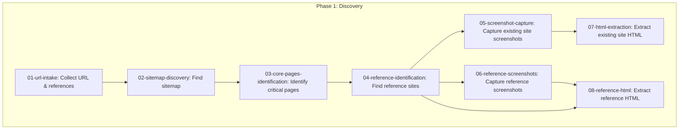
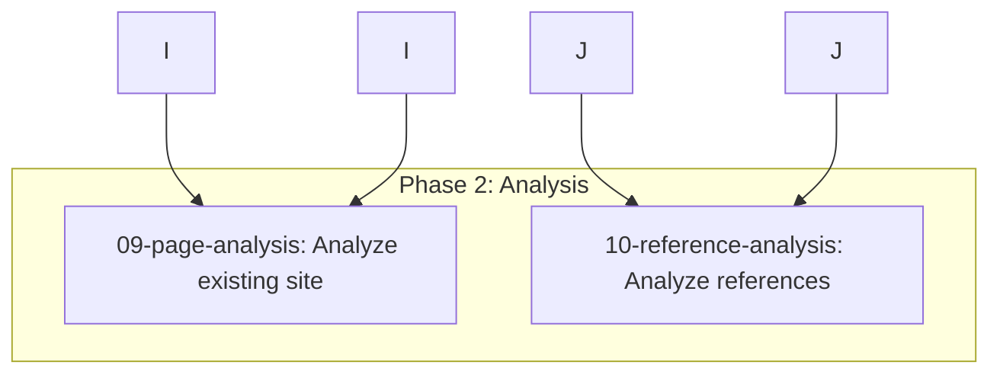
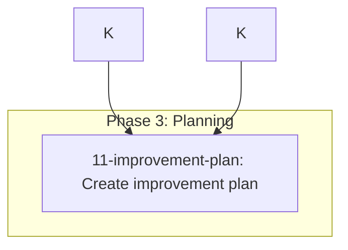
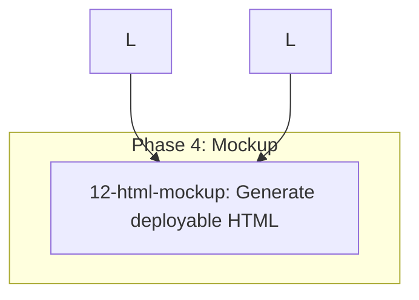
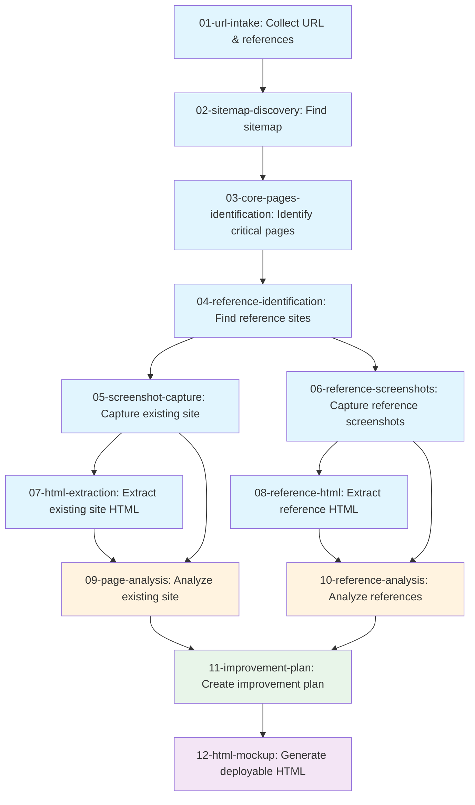

# Workflow Diagram

Website Redesign — Discovery, Analysis & Mockup

## Phase 1: Discovery (Input Gathering)

## Phase 2: Analysis

## Phase 3: Planning

## Phase 4: Mockup

## Full Flow

## Outputs

| Step | Output Directory | Description |
|------|------------------|-------------|
| 01 | `outputs/01-url-intake/` | Website URL and user references |
| 02 | `outputs/02-sitemap/` | Parsed sitemap structure |
| 03 | `outputs/03-core-pages/` | Prioritized core pages list |
| 04 | `outputs/04-reference-sites/` | Reference sites by perspective |
| 05 | `outputs/05-screenshots/` | Existing site screenshots |
| 06 | `outputs/06-reference-screenshots/` | Reference site screenshots |
| 07 | `outputs/07-html-extraction/` | Existing site HTML source |
| 08 | `outputs/08-reference-html/` | Reference site HTML source |
| 09 | `outputs/09-page-analysis/` | Existing site analysis |
| 10 | `outputs/10-reference-analysis/` | Reference best practices |
| 11 | `outputs/11-improvement-plan/` | Improvement recommendations |
| 12 | `outputs/12-mockup/` | Deployable HTML mockups |
